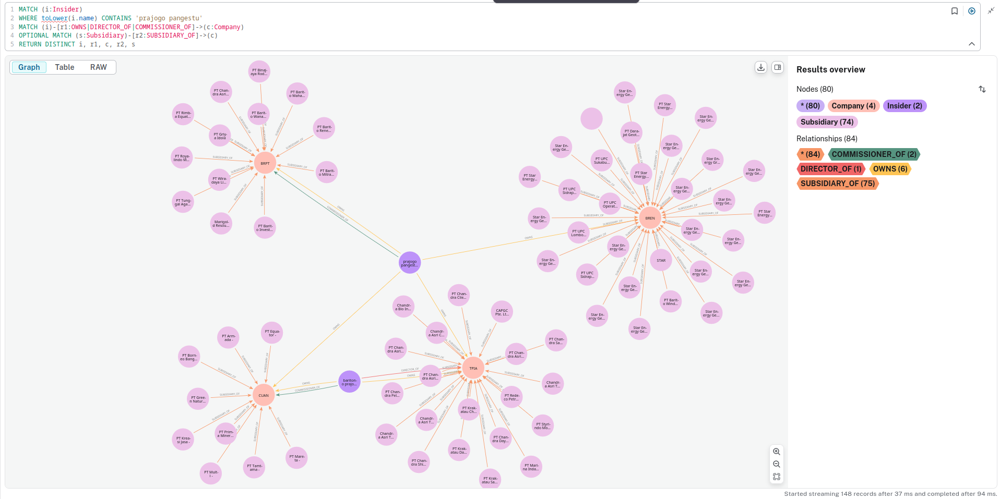

# IDX-BEI Data Analysis Toolkit

A comprehensive toolkit for fetching, processing, and analyzing data from the Indonesia Stock Exchange (IDX / Bursa Efek Indonesia). This project provides scrapers for market data, company profiles, and financial ratios, with integration into Neo4j for network analysis and PostgreSQL for financial modeling.



## 🚀 Features

- **Data Scraping**: Efficiently fetch data from the official IDX API using `curl_cffi` to handle rate limiting and browser emulation.
- **Graph Analysis**: Ingest company data into **Neo4j** to visualize and query relationships between companies, directors, commissioners, and shareholders.
- **Financial Ratios**: Process and analyze financial ratios with support for PostgreSQL ingestion.
- **iXBRL Parser**: Extract data from inline XBRL financial reports.
- **Yahoo Finance Integration**: Supplemental market data via `yfinance`.

## 🛠️ Tech Stack

- **Language**: Python 3.13+
- **Database**: Neo4j (Graph), PostgreSQL (Relational)
- **Tools**: `uv` for package management, Docker for database services.
- **Libraries**: `pandas`, `sqlalchemy`, `neo4j`, `matplotlib`, `seaborn`, `scikit-learn`.

## 📋 Prerequisites

- **Python 3.13+** (Recommended: [uv](https://github.com/astral-sh/uv))
- **Docker & Docker Compose** (for Neo4j)

## 🚀 Getting Started

### 1. Clone the repository
```bash
git clone https://github.com/yourusername/idx-bei.git
cd idx-bei
```

### 2. Set up the Environment
We use `uv` for fast, reliable Python dependency management.

```bash
cd python
uv sync
```

### 3. Start Database Services
Use Docker Compose to spin up a Neo4j instance:

```bash
docker compose up -d
```
Neo4j will be available at:
- Web UI: http://localhost:7474
- Bolt: bolt://localhost:7687
- Default Login: `neo4j` / `password`

### 4. Running Scrapers
The `python/` directory contains various scripts for data collection:

```bash
# Scrape all company profiles
uv run scrape_company_profiles.py

# Scrape financial ratios
uv run scrape_financial_ratio.py

# Scrape broker search results
uv run scrape_broker_search.py
```

### 5. Graph Ingestion & Analysis
Open the Jupyter notebook for Neo4j ingestion and network analysis:

```bash
cd python
uv run jupyter notebook neo4j.ipynb
```

## 📁 Repository Structure

```text
idx-bei/
├── data/                  # Stored JSON data (ignored by git in production)
├── docker-compose/        # Docker service configurations
├── docker-compose.yml     # Main docker-compose file
├── python/                # Core Python scripts and notebooks
│   ├── scrape_*.py        # Data collection scripts
│   ├── neo4j_ingest.py    # Script to push data to Neo4j
│   ├── neo4j.ipynb        # Main analysis & ingestion notebook
│   └── pyproject.toml     # Python dependencies (managed by uv)
└── LICENSE                # MIT License
```

## 📊 Data Insights

The Neo4j integration allows for powerful queries, such as:
- Identifying interlocking directorates (insiders holding positions in multiple companies).
- Mapping complex ownership structures and ultimate beneficiaries.
- Tracking historical trading performance against corporate actions.

Example Cypher query to find insider ownership:
```cypher
MATCH (i:Insider)-[owns:OWNS]->(c:Company)-[:HAS_TRADE_DAY]->(td:TradeDay)
WITH i, owns.jumlah AS sharesOwned, c, td.close AS latestClosePrice
WITH i, sum(sharesOwned * latestClosePrice) AS totalValue
RETURN i.name AS InsiderName, totalValue
ORDER BY totalValue DESC
```

## 📄 License

This project is licensed under the MIT License - see the [LICENSE](LICENSE) file for details.

## 🤝 Contributing

Contributions are welcome! Please feel free to submit a Pull Request.

---
*Disclaimer: This project is for educational and research purposes only. Ensure you comply with IDX terms of service when using these scripts.*
